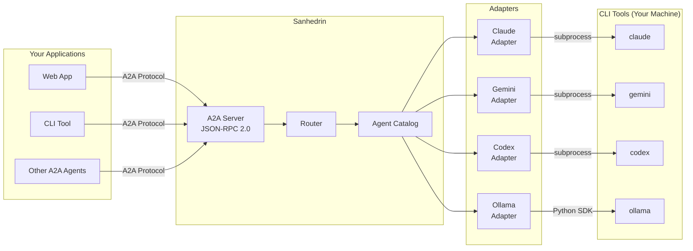

<div align="center">

# ⚖️ SANHEDRIN

### *The Council of AI Agents*

[](https://a2a-protocol.org)
[](https://python.org)
[](LICENSE)
[](#-cost-effective-design)

---

**Unify Claude Code, Gemini CLI, Codex CLI, and Ollama under one protocol**

*Use your existing CLI subscriptions - no extra API costs!*

[Features](#-features) • [Quick Start](#-quick-start) • [Architecture](#-architecture) • [CLI Tools](#-supported-cli-tools) • [Documentation](#-documentation)

---

```
┌─────────────────────────────────────────────────────────────────┐
│                                                                 │
│   "Like the ancient council of sages, Sanhedrin brings         │
│    together multiple AI agents to deliberate and collaborate   │
│    on complex tasks - each contributing unique capabilities."  │
│                                                                 │
└─────────────────────────────────────────────────────────────────┘
```

</div>

## 💡 What is Sanhedrin?

Sanhedrin is an **A2A Protocol** (Agent-to-Agent) implementation that wraps your locally-installed AI CLI tools and exposes them as interoperable agents. Instead of paying for API calls, Sanhedrin invokes the CLIs you already have installed.

```
Your App  ──▶  Sanhedrin  ──▶  claude / gemini / codex / ollama
              (A2A Server)      (Your existing CLI tools)
```

## 💰 Cost-Effective Design

| Traditional Approach | Sanhedrin Approach |
|---------------------|-------------------|
| Pay per API token | **Use existing subscriptions** |
| Multiple API keys | **CLI tools already authenticated** |
| Rate limits per API | **Your CLI's rate limits** |
| Extra costs stack up | **$0 extra cost** |

**How it works:**
- `claude` CLI → Uses your Anthropic/Claude subscription
- `gemini` CLI → Uses your Google account
- `codex` CLI → Uses your ChatGPT Plus/Pro subscription
- `ollama` → **100% free** local inference

## ✨ Features

| Feature | Description |
|---------|-------------|
| 🔌 **A2A Compatible** | Full [Agent2Agent Protocol v0.3](https://a2a-protocol.org) implementation |
| 🤖 **Multi-Agent** | Claude, Gemini, Codex, Ollama in one unified system |
| 💻 **CLI-First** | Invokes your installed CLIs - no API keys needed |
| 🌊 **Streaming** | Real-time SSE-based responses |
| 🎯 **Smart Routing** | Capability-based agent selection |
| 📡 **Discovery** | Standard `/.well-known/agent.json` endpoint |
| 🔄 **Task Management** | Full A2A task lifecycle (submitted → working → completed) |
| 🔒 **Secure** | OAuth2, JWT, API Key authentication support |

## 🚀 Quick Start

### Installation

```bash
# Install with all features
pip install sanhedrin[all]

# Or minimal install
pip install sanhedrin

# With server support
pip install sanhedrin[server]

# With Ollama support
pip install sanhedrin[ollama]
```

### Start an Agent Server

```bash
# Expose Claude Code as an A2A agent
sanhedrin serve --adapter claude --port 8000

# Expose Gemini as an A2A agent
sanhedrin serve --adapter gemini --port 8001

# Expose Ollama (free local inference)
sanhedrin serve --adapter ollama --port 8002 --model llama3.2
```

### Discover & Use Agents

```bash
# Discover agent capabilities
curl http://localhost:8000/.well-known/agent.json

# Send a message (JSON-RPC 2.0)
curl -X POST http://localhost:8000/a2a \
  -H "Content-Type: application/json" \
  -d '{
    "jsonrpc": "2.0",
    "id": 1,
    "method": "message/send",
    "params": {
      "message": {
        "role": "user",
        "parts": [{"kind": "text", "text": "Write a Python hello world"}]
      }
    }
  }'
```

### Python Client

```python
import asyncio
from sanhedrin.client import A2AClient

async def main():
    async with A2AClient("http://localhost:8000") as client:
        # Discover agent
        card = await client.get_agent_card()
        print(f"Connected to: {card.name}")
        print(f"Skills: {[s.name for s in card.skills]}")

        # Send message
        task = await client.send_message("Explain async/await in Python")
        print(f"Response: {task.status.message.parts[0].text}")

asyncio.run(main())
```

## 🏗️ Architecture

```
┌──────────────────────────────────────────────────────────────────────┐
│                           SANHEDRIN                                  │
├──────────────────────────────────────────────────────────────────────┤
│                                                                      │
│  ┌─────────────┐    ┌─────────────┐    ┌─────────────────────────┐  │
│  │   Client    │───▶│  A2A Server │───▶│     Adapter Layer       │  │
│  │  (Your App) │    │  (FastAPI)  │    │                         │  │
│  └─────────────┘    └─────────────┘    │  ┌───────────────────┐  │  │
│                            │           │  │  Claude Adapter   │──┼──┼──▶ claude CLI
│  ┌─────────────┐          │           │  └───────────────────┘  │  │
│  │ Other A2A   │──────────┤           │  ┌───────────────────┐  │  │
│  │   Agents    │          │           │  │  Gemini Adapter   │──┼──┼──▶ gemini CLI
│  └─────────────┘          │           │  └───────────────────┘  │  │
│                           ▼           │  ┌───────────────────┐  │  │
│                    ┌─────────────┐    │  │  Codex Adapter    │──┼──┼──▶ codex CLI
│                    │   Router    │───▶│  └───────────────────┘  │  │
│                    │  (Skills)   │    │  ┌───────────────────┐  │  │
│                    └─────────────┘    │  │  Ollama Adapter   │──┼──┼──▶ ollama
│                           │           │  └───────────────────┘  │  │
│                           ▼           │                         │  │
│                    ┌─────────────┐    └─────────────────────────┘  │
│                    │  Catalog    │                                  │
│                    │ (Registry)  │                                  │
│                    └─────────────┘                                  │
│                                                                      │
└──────────────────────────────────────────────────────────────────────┘
```

### Mermaid Diagram



## 🤖 Supported CLI Tools

| CLI Tool | Command | Auth | Cost | Capabilities |
|----------|---------|------|------|--------------|
| **Claude Code** | `claude` | ANTHROPIC_API_KEY or OAuth | Your subscription | Code gen, review, debugging, agentic tasks |
| **Gemini CLI** | `gemini` | GOOGLE_API_KEY or OAuth | Your Google account | Reasoning, search grounding, code |
| **Codex CLI** | `codex` | CODEX_API_KEY or ChatGPT | Your ChatGPT sub | Code gen, file operations |
| **Ollama** | `ollama` | None (local) | **Free** | Local inference, privacy-focused |

### Prerequisites

Make sure you have the CLI tools installed:

```bash
# Claude Code
npm install -g @anthropic-ai/claude-code
# or via installer at https://claude.ai/code

# Gemini CLI
npm install -g @google/gemini-cli

# Codex CLI
npm install -g @openai/codex

# Ollama (local LLMs)
# https://ollama.ai
curl -fsSL https://ollama.ai/install.sh | sh
ollama pull llama3.2
```

## 📋 A2A Protocol Compliance

Sanhedrin implements the [A2A Protocol v0.3](https://a2a-protocol.org/latest/specification/):

### Agent Card (Discovery)
```json
{
  "name": "Claude Code Agent",
  "description": "Anthropic's Claude Code CLI as an A2A agent",
  "url": "http://localhost:8000",
  "protocolVersion": "0.3.0",
  "capabilities": {
    "streaming": true,
    "pushNotifications": false
  },
  "skills": [
    {
      "id": "code-generation",
      "name": "Code Generation",
      "description": "Generate code from natural language",
      "tags": ["coding", "generation"]
    }
  ]
}
```

### Supported Methods
- `message/send` - Send message, get Task response
- `message/stream` - Send message, stream SSE events
- `tasks/get` - Retrieve task by ID
- `tasks/cancel` - Cancel running task
- `tasks/pushNotificationConfig/*` - Webhook configuration

### Task States
```
SUBMITTED → WORKING → COMPLETED
                   → FAILED
                   → INPUT_REQUIRED → WORKING
                   → CANCELED
```

## 🔧 Configuration

### Environment Variables

```bash
# Optional - CLIs use their own auth by default
export ANTHROPIC_API_KEY="sk-..."      # For Claude
export GOOGLE_API_KEY="..."            # For Gemini
export CODEX_API_KEY="..."             # For Codex

# Server config
export SANHEDRIN_SERVER_HOST="0.0.0.0"
export SANHEDRIN_SERVER_PORT="8000"
export SANHEDRIN_SERVER_DEBUG="false"

# Ollama config
export OLLAMA_HOST="http://localhost:11434"
export OLLAMA_MODEL="llama3.2"
```

### Configuration File

```bash
# Copy example config
cp .env.example .env
```

## 📚 Documentation

- [Getting Started Guide](docs/getting-started.md)
- [A2A Protocol Overview](docs/a2a-protocol.md)
- [Adapter Development](docs/adapters.md)
- [Multi-Agent Orchestration](docs/orchestration.md)
- [API Reference](docs/api-reference.md)

## 🧪 Examples

```bash
# Simple single-agent usage
python examples/simple_agent.py

# Multi-agent orchestration
python examples/multi_agent_chat.py

# Task delegation between agents
python examples/task_delegation.py
```

## 🛠️ Development

```bash
# Clone repository
git clone https://github.com/consigcody94/sanhedrin.git
cd sanhedrin

# Install in development mode
pip install -e ".[dev]"

# Run tests
pytest

# Type checking
mypy src/sanhedrin

# Linting
ruff check src/sanhedrin
```

## 🤝 Contributing

Contributions are welcome! See [CONTRIBUTING.md](CONTRIBUTING.md) for guidelines.

### Adding a New Adapter

1. Create `src/sanhedrin/adapters/your_adapter.py`
2. Extend `BaseAdapter` class
3. Implement `execute()` and `execute_stream()`
4. Register in `adapters/registry.py`
5. Add tests in `tests/unit/test_adapters.py`

## 📄 License

Apache 2.0 - See [LICENSE](LICENSE) for details.

## 🙏 Acknowledgments

- [A2A Protocol](https://a2a-protocol.org) by Google & Linux Foundation
- [Anthropic](https://anthropic.com) for Claude Code
- [Google](https://google.com) for Gemini CLI
- [OpenAI](https://openai.com) for Codex CLI
- [Ollama](https://ollama.ai) for local LLM inference

---

<div align="center">

**Built for the AI Agent ecosystem**

*Sanhedrin - Where AI agents convene*

[⬆ Back to top](#️-sanhedrin)

</div>
