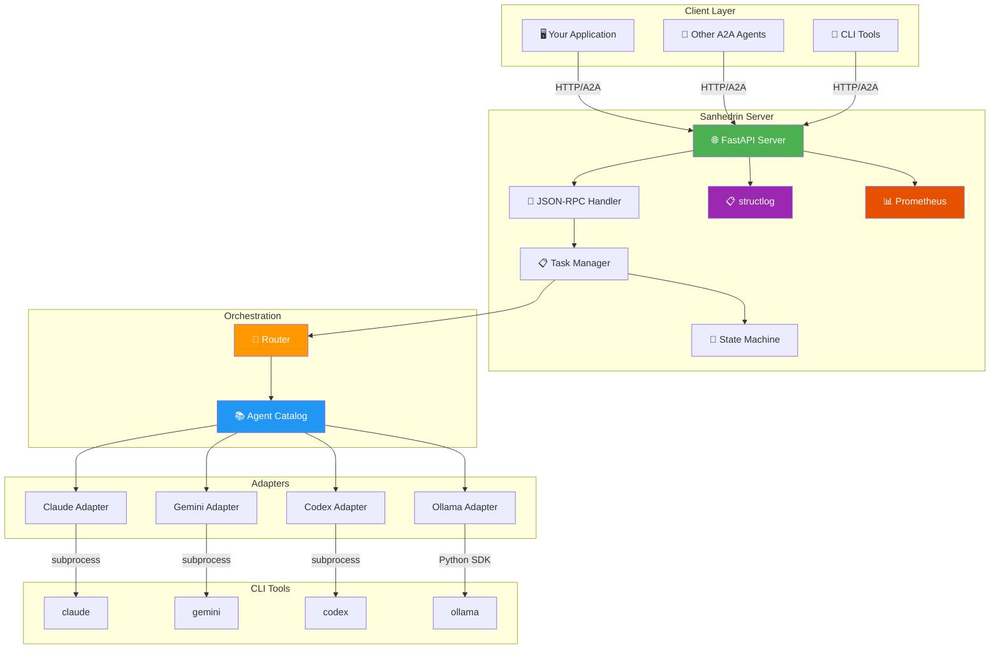
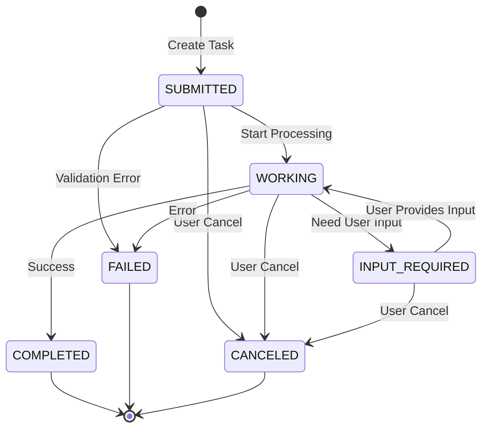
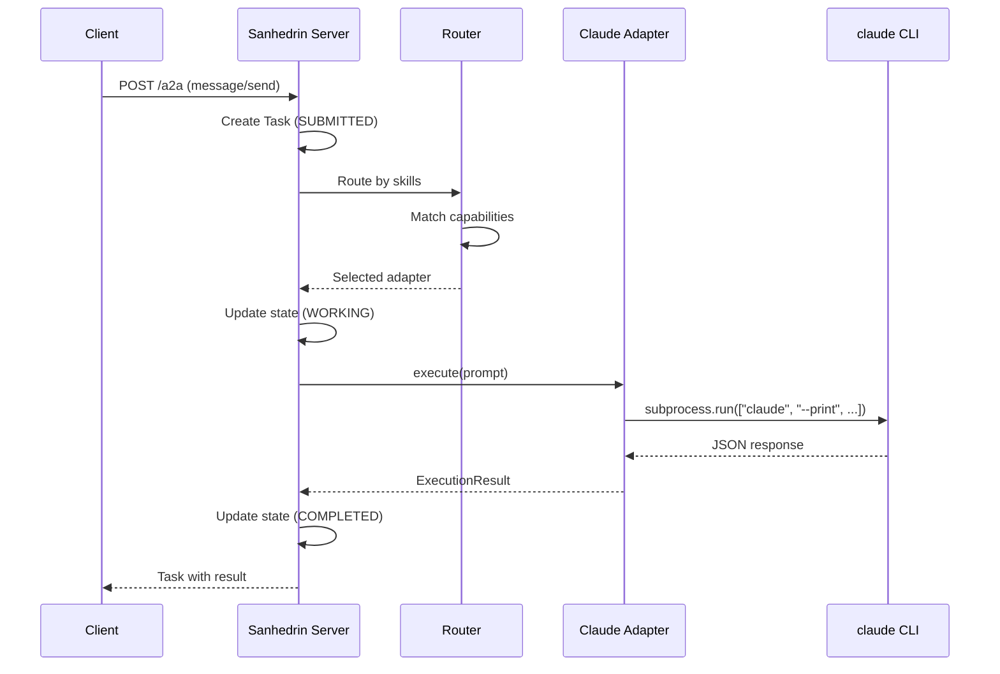

<div align="center">

<!-- Animated Header -->


<br/>

<!-- Badges Row 1 -->
<p>
<a href="https://a2a-protocol.org"></a>
<a href="https://python.org"></a>
<a href="LICENSE"></a>
<a href="#-zero-cost-architecture"></a>
</p>

<!-- Badges Row 2 -->
<p>


</p>

<!-- Badges Row 3 - Modernization -->
<p>


</p>

<br/>

<!-- Tagline Box -->
<table>
<tr>
<td>

```
╔══════════════════════════════════════════════════════════════════════════╗
║                                                                          ║
║   🏛️  Like the ancient council of sages, Sanhedrin brings together      ║
║       multiple AI agents to deliberate on complex tasks — each           ║
║       contributing unique capabilities through one unified protocol.     ║
║                                                                          ║
║       ✨ CLI-First: Use your existing subscriptions                      ║
║       ✨ A2A Protocol: Industry-standard interoperability                ║
║       ✨ Multi-Agent: Intelligent routing & orchestration                ║
║       ✨ Production-Ready: Structured logging & Prometheus metrics       ║
║                                                                          ║
╚══════════════════════════════════════════════════════════════════════════╝
```

</td>
</tr>
</table>

<br/>

<!-- Quick Links -->
[**🚀 Quick Start**](#-quick-start) · [**📖 Documentation**](#-documentation) · [**🏗️ Architecture**](#-architecture) · [**🤝 Contributing**](#-contributing)

<br/>

</div>

---

<br/>

## 🎯 Why Sanhedrin?

<table>
<tr>
<td width="50%">

### ❌ Traditional API Approach
```
Your App → Claude API    💸 $$$
        → Gemini API    💸 $$$
        → OpenAI API    💸 $$$
        ─────────────────────
        Multiple API keys 🔑
        Multiple rate limits ⏱️
        Costs stack up fast 📈
```

</td>
<td width="50%">

### ✅ Sanhedrin Approach
```
Your App → Sanhedrin → claude CLI ✨
                     → gemini CLI ✨
                     → codex CLI  ✨
                     → ollama     🆓
        ─────────────────────────────
        Use existing subscriptions 🎫
        One unified protocol 🔌
        $0 extra cost 💰
```

</td>
</tr>
</table>

<br/>

---

<br/>

## 💰 Zero-Cost Architecture

<div align="center">

| You Already Have | Sanhedrin Uses | Extra Cost |
|:----------------:|:--------------:|:----------:|
| Claude Pro/Team subscription | `claude` CLI | **$0** |
| Google account | `gemini` CLI | **$0** |
| ChatGPT Plus/Pro | `codex` CLI | **$0** |
| A computer | `ollama` local | **$0** |

</div>

> **💡 Key Insight:** Sanhedrin invokes your *locally installed CLI tools* via subprocess.
> It doesn't make API calls — it uses the same CLIs you already use manually.

<br/>

---

<br/>

## ✨ Features at a Glance

<div align="center">

```
┌─────────────────────────────────────────────────────────────────────────────┐
│                                                                             │
│   ┌───────────────┐  ┌───────────────┐  ┌───────────────┐  ┌─────────────┐ │
│   │  🔌 A2A v0.3  │  │  🤖 4 Agents  │  │  🌊 Streaming │  │ 🎯 Routing  │ │
│   │   Protocol    │  │   Supported   │  │     SSE       │  │   Engine    │ │
│   └───────────────┘  └───────────────┘  └───────────────┘  └─────────────┘ │
│                                                                             │
│   ┌───────────────┐  ┌───────────────┐  ┌───────────────┐  ┌─────────────┐ │
│   │  📡 Discovery │  │  📊 Prometheus│  │  💻 CLI-First │  │ 🆓 Ollama   │ │
│   │  Agent Cards  │  │   Metrics     │  │   No API $$$  │  │   Free!     │ │
│   └───────────────┘  └───────────────┘  └───────────────┘  └─────────────┘ │
│                                                                             │
│   ┌───────────────┐  ┌───────────────┐  ┌───────────────┐  ┌─────────────┐ │
│   │  📋 Structured│  │  🔒 Security  │  │  🔄 Tasks     │  │ ⚡ Async    │ │
│   │   Logging     │  │  Middleware   │  │  Lifecycle    │  │  TaskGroup  │ │
│   └───────────────┘  └───────────────┘  └───────────────┘  └─────────────┘ │
│                                                                             │
└─────────────────────────────────────────────────────────────────────────────┘
```

</div>

<br/>

<table>
<tr>
<td width="50%">

### 🔌 Protocol & Standards
- **A2A Protocol v0.3** - Full compliance
- **JSON-RPC 2.0** - Standard transport
- **SSE Streaming** - Real-time responses
- **Agent Cards** - `.well-known/agent.json`
- **Prometheus Metrics** - `/metrics` endpoint

</td>
<td width="50%">

### 🛠️ Architecture
- **Multi-Agent Orchestration** - Catalog & Router
- **Skill-Based Routing** - Match tasks to agents
- **Task State Machine** - Full lifecycle management
- **Pydantic v2** - Type-safe models with `StrEnum`
- **Structured Logging** - JSON logs via `structlog`

</td>
</tr>
</table>

<br/>

---

<br/>

## 🚀 Quick Start

### 📦 Installation

```bash
# Full installation (recommended)
pip install sanhedrin[all]

# Minimal (core only)
pip install sanhedrin

# Server + CLI
pip install sanhedrin[server,cli]

# With Ollama support
pip install sanhedrin[ollama]
```

### ⚡ 30-Second Demo

```bash
# 1️⃣ Start a server (using Claude Code)
sanhedrin serve --adapter claude-code --port 8000

# 2️⃣ Discover the agent
curl http://localhost:8000/.well-known/agent.json | jq .

# 3️⃣ Send a message
sanhedrin send http://localhost:8000 "Write a Python hello world"
```

<br/>

### 🖥️ Server Examples

<table>
<tr>
<td>

**Claude Code**
```bash
sanhedrin serve \
  --adapter claude-code \
  --port 8000
```

</td>
<td>

**Gemini CLI**
```bash
sanhedrin serve \
  --adapter gemini-cli \
  --port 8001
```

</td>
</tr>
<tr>
<td>

**Codex CLI**
```bash
sanhedrin serve \
  --adapter codex-cli \
  --port 8002
```

</td>
<td>

**Ollama (FREE)**
```bash
sanhedrin serve \
  --adapter ollama \
  --port 8003
```

</td>
</tr>
</table>

<br/>

### 🐍 Python Client

```python
import asyncio
from sanhedrin import get_adapter

async def main():
    # Get an adapter directly (no server needed!)
    adapter = get_adapter("claude-code")  # or "gemini-cli", "ollama", etc.
    await adapter.initialize()

    # Execute a prompt
    result = await adapter.execute("Explain recursion in Python")
    print(result.content)

    # Or stream the response
    async for chunk in adapter.execute_stream("Write a haiku about coding"):
        print(chunk.content, end="", flush=True)

asyncio.run(main())
```

<br/>

### 🌐 HTTP Client (A2A Protocol)

```python
import httpx

# JSON-RPC 2.0 request
response = httpx.post("http://localhost:8000/a2a", json={
    "jsonrpc": "2.0",
    "id": 1,
    "method": "message/send",
    "params": {
        "message": {
            "role": "user",
            "parts": [{"text": "Hello, agent!"}]
        }
    }
})

print(response.json())
```

<br/>

---

<br/>

## 🏗️ Architecture

### System Overview

```
                              ╔═══════════════════════════════════════════╗
                              ║              S A N H E D R I N            ║
                              ╠═══════════════════════════════════════════╣
   ┌──────────────┐           ║                                           ║
   │  Your App    │──────────▶║  ┌─────────────────────────────────────┐  ║
   └──────────────┘    A2A    ║  │           FastAPI Server            │  ║
                      Protocol║  │  • /.well-known/agent.json (Card)   │  ║
   ┌──────────────┐           ║  │  • /a2a (JSON-RPC endpoint)         │  ║
   │ Other Agents │──────────▶║  │  • /a2a/stream (SSE streaming)      │  ║
   └──────────────┘           ║  │  • /health • /metrics (Prometheus)  │  ║
                              ║  └─────────────────────────────────────┘  ║
                              ║           │                  │            ║
                              ║     ┌─────▼──────┐   ┌──────▼───────┐    ║
                              ║     │  structlog  │   │  Prometheus  │    ║
                              ║     │  (JSON/Dev) │   │   Metrics    │    ║
                              ║     └────────────┘   └──────────────┘    ║
                              ║                     │                      ║
                              ║                     ▼                      ║
                              ║  ┌─────────────────────────────────────┐  ║
                              ║  │          Orchestration Layer         │  ║
                              ║  │  ┌─────────────┐ ┌─────────────────┐ │  ║
                              ║  │  │   Router    │ │    Catalog      │ │  ║
                              ║  │  │ (Skills/RR) │ │ (Agent Registry)│ │  ║
                              ║  │  └─────────────┘ └─────────────────┘ │  ║
                              ║  └─────────────────────────────────────┘  ║
                              ║                     │                      ║
                              ║                     ▼                      ║
                              ║  ┌─────────────────────────────────────┐  ║
                              ║  │           Adapter Layer              │  ║
                              ║  │                                       │  ║
                              ║  │  ┌─────────┐ ┌─────────┐ ┌─────────┐ │  ║
                              ║  │  │ Claude  │ │ Gemini  │ │  Codex  │ │  ║
                              ║  │  │ Adapter │ │ Adapter │ │ Adapter │ │  ║
                              ║  │  └────┬────┘ └────┬────┘ └────┬────┘ │  ║
                              ║  │       │          │          │       │  ║
                              ║  │  ┌────┴────┐     │     ┌────┴────┐  │  ║
                              ║  │  │ Ollama  │     │     │  Base   │  │  ║
                              ║  │  │ Adapter │     │     │ Adapter │  │  ║
                              ║  │  └────┬────┘     │     └─────────┘  │  ║
                              ║  └───────┼─────────┼───────────────────┘  ║
                              ╚══════════╪═════════╪═══════════════════════╝
                                         │         │
                    ┌────────────────────┼─────────┼────────────────────┐
                    │                    ▼         ▼                    │
                    │  ┌─────────┐ ┌─────────┐ ┌─────────┐ ┌─────────┐ │
                    │  │ claude  │ │ gemini  │ │  codex  │ │ ollama  │ │
                    │  │   CLI   │ │   CLI   │ │   CLI   │ │ (local) │ │
                    │  └─────────┘ └─────────┘ └─────────┘ └─────────┘ │
                    │                                                   │
                    │              🖥️  YOUR MACHINE                    │
                    └───────────────────────────────────────────────────┘
```

<br/>

### Mermaid Diagrams

<details>
<summary><b>📊 Click to expand: Flow Diagram</b></summary>


```mermaid
graph TB
    subgraph "Client Layer"
        C1[🖥️ Your Application]
        C2[🤖 Other A2A Agents]
        C3[🔧 CLI Tools]
    end

    subgraph "Sanhedrin Server"
        direction TB
        API[🌐 FastAPI Server]
        RPC[📡 JSON-RPC Handler]
        TM[📋 Task Manager]
        SM[🔄 State Machine]
        LOG[📋 structlog]
        MET[📊 Prometheus]
    end

    subgraph "Orchestration"
        CAT[📚 Agent Catalog]
        RTR[🎯 Router]
    end

    subgraph "Adapters"
        A1[Claude Adapter]
        A2[Gemini Adapter]
        A3[Codex Adapter]
        A4[Ollama Adapter]
    end

    subgraph "CLI Tools"
        CLI1[claude]
        CLI2[gemini]
        CLI3[codex]
        CLI4[ollama]
    end

    C1 & C2 & C3 -->|HTTP/A2A| API
    API --> RPC
    API --> LOG & MET
    RPC --> TM
    TM --> SM
    TM --> RTR
    RTR --> CAT
    CAT --> A1 & A2 & A3 & A4
    A1 -->|subprocess| CLI1
    A2 -->|subprocess| CLI2
    A3 -->|subprocess| CLI3
    A4 -->|Python SDK| CLI4

    style API fill:#4CAF50,color:white
    style CAT fill:#2196F3,color:white
    style RTR fill:#FF9800,color:white
    style LOG fill:#9C27B0,color:white
    style MET fill:#E65100,color:white
```

</details>

<details>
<summary><b>🔄 Click to expand: Task State Machine</b></summary>


```mermaid
stateDiagram-v2
    [*] --> SUBMITTED: Create Task

    SUBMITTED --> WORKING: Start Processing
    SUBMITTED --> CANCELED: User Cancel
    SUBMITTED --> FAILED: Validation Error

    WORKING --> COMPLETED: Success
    WORKING --> FAILED: Error
    WORKING --> INPUT_REQUIRED: Need User Input
    WORKING --> CANCELED: User Cancel

    INPUT_REQUIRED --> WORKING: User Provides Input
    INPUT_REQUIRED --> CANCELED: User Cancel

    COMPLETED --> [*]
    FAILED --> [*]
    CANCELED --> [*]
```

</details>

<details>
<summary><b>🔀 Click to expand: Sequence Diagram</b></summary>


```mermaid
sequenceDiagram
    participant Client
    participant Server as Sanhedrin Server
    participant Router
    participant Adapter as Claude Adapter
    participant CLI as claude CLI

    Client->>Server: POST /a2a (message/send)
    Server->>Server: Create Task (SUBMITTED)
    Server->>Router: Route by skills
    Router->>Router: Match capabilities
    Router-->>Server: Selected adapter
    Server->>Server: Update state (WORKING)
    Server->>Adapter: execute(prompt)
    Adapter->>CLI: subprocess.run(["claude", "--print", ...])
    CLI-->>Adapter: JSON response
    Adapter-->>Server: ExecutionResult
    Server->>Server: Update state (COMPLETED)
    Server-->>Client: Task with result
```

</details>

<br/>

---

<br/>

## 🤖 Supported Agents

<div align="center">

| Agent | CLI Command | Auth Method | Cost | Best For |
|:-----:|:-----------:|:-----------:|:----:|:--------:|
|  | `claude` | OAuth / API Key | Your Sub | Code, Analysis |
|  | `gemini` | OAuth / API Key | Your Account | Reasoning, Search |
|  | `codex` | OAuth / API Key | Your ChatGPT | Code Gen |
|  | `ollama` | None (Local) | **FREE** | Privacy, Local |

</div>

<br/>

### 📥 CLI Installation

<table>
<tr>
<td width="50%">

**Claude Code CLI**
```bash
# Via npm
npm install -g @anthropic-ai/claude-code

# Or download from
# https://claude.ai/code
```

**Gemini CLI**
```bash
npm install -g @google/gemini-cli
```

</td>
<td width="50%">

**Codex CLI**
```bash
npm install -g @openai/codex
```

**Ollama** (100% Free Local)
```bash
# macOS/Linux
curl -fsSL https://ollama.ai/install.sh | sh

# Pull a model
ollama pull llama3.2
```

</td>
</tr>
</table>

<br/>

---

<br/>

## 📋 A2A Protocol Reference

### Agent Card Structure

```json
{
  "name": "Sanhedrin Claude Agent",
  "description": "Claude Code CLI exposed as A2A agent",
  "url": "http://localhost:8000/a2a",
  "version": "0.1.0",
  "protocolVersion": "0.3.0",
  "capabilities": {
    "streaming": true,
    "pushNotifications": false,
    "stateTransitionHistory": true
  },
  "skills": [
    {
      "id": "code-generation",
      "name": "Code Generation",
      "description": "Generate code from natural language",
      "tags": ["coding", "generation", "development"],
      "examples": [
        "Write a Python function to sort a list",
        "Create a REST API endpoint in Go"
      ]
    }
  ],
  "provider": {
    "organization": "Sanhedrin",
    "url": "https://github.com/consigcody94/sanhedrin"
  }
}
```

### JSON-RPC Methods

| Method | Description | Streaming |
|--------|-------------|:---------:|
| `message/send` | Send message, get complete response | ❌ |
| `message/stream` | Send message, stream SSE events | ✅ |
| `tasks/get` | Retrieve task by ID | ❌ |
| `tasks/cancel` | Cancel a running task | ❌ |

### Observability Endpoints

| Endpoint | Description |
|----------|-------------|
| `GET /health` | Adapter health status + active task count |
| `GET /metrics` | Prometheus-format metrics (requests, tasks, durations) |
| `GET /docs` | Swagger UI (auto-generated) |
| `GET /redoc` | ReDoc documentation |

<br/>

---

<br/>

## 🧪 Examples

```bash
# Clone the repo
git clone https://github.com/consigcody94/sanhedrin.git
cd sanhedrin

# Run examples
python examples/simple_agent.py       # Basic usage
python examples/multi_agent_chat.py   # Orchestration demo
python examples/a2a_client.py         # A2A protocol client
python examples/ollama_local.py       # Free local inference
```

<br/>

---

<br/>

## 🛠️ Development

```bash
# Clone & setup
git clone https://github.com/consigcody94/sanhedrin.git
cd sanhedrin
pip install -e ".[dev]"

# Run tests
pytest -v

# Type checking (strict mode)
mypy src/sanhedrin

# Lint & format
ruff check src/
ruff format src/
```

### 🔧 Tech Stack

<div align="center">

| Category | Technology |
|:--------:|:----------:|
| **Runtime** | Python 3.11+ with `StrEnum`, `TaskGroup`, `Self` |
| **Web Framework** | FastAPI + Uvicorn (ASGI) |
| **Type Safety** | Pydantic v2 (strict) + mypy (strict) |
| **Logging** | `structlog` (JSON in prod, colored in dev) |
| **Metrics** | `prometheus_client` (counters, histograms, gauges) |
| **Linting** | Ruff (lint + format + isort + security) |
| **Testing** | pytest + pytest-asyncio + coverage |
| **CI/CD** | GitHub Actions (lint, test matrix, security, Docker) |
| **Container** | Multi-stage Docker + docker-compose |

</div>

### Project Structure

```
sanhedrin/
├── src/sanhedrin/
│   ├── core/              # A2A types, state machine, errors
│   │   ├── types.py       # Pydantic v2 models with StrEnum
│   │   ├── state_machine.py
│   │   └── errors.py      # Error hierarchy with A2A codes
│   ├── adapters/          # CLI tool wrappers
│   │   ├── base.py        # BaseAdapter ABC (Self, retry backoff)
│   │   ├── claude_adapter.py   # @override decorators
│   │   ├── gemini_adapter.py
│   │   ├── codex_adapter.py
│   │   ├── ollama_adapter.py
│   │   └── registry.py    # Adapter registration
│   ├── server/            # FastAPI A2A server
│   │   ├── app.py         # App with app.state DI + TaskGroup
│   │   ├── task_manager.py
│   │   ├── metrics.py     # Prometheus metrics module
│   │   └── handlers/      # JSON-RPC handlers
│   ├── orchestration/     # Multi-agent coordination
│   │   ├── catalog.py     # Agent registry
│   │   └── router.py      # Routing strategies
│   ├── auth/              # Security middleware
│   ├── config/            # Pydantic settings (single source of truth)
│   ├── logging.py         # structlog configuration
│   └── cli/               # Typer CLI
├── examples/              # Usage examples
├── tests/                 # Test suite (unit, integration, e2e)
└── pyproject.toml         # Modern packaging (hatchling)
```

<br/>

---

<br/>

## 🤝 Contributing

Contributions are welcome! Here's how:

1. **Fork** the repository
2. **Create** a feature branch (`git checkout -b feature/amazing`)
3. **Commit** your changes (`git commit -m 'Add amazing feature'`)
4. **Push** to the branch (`git push origin feature/amazing`)
5. **Open** a Pull Request

### Adding a New Adapter

```python
# src/sanhedrin/adapters/my_adapter.py
from typing_extensions import override
from sanhedrin.adapters.base import BaseAdapter, ExecutionResult

class MyAdapter(BaseAdapter):
    @property
    @override
    def name(self) -> str:
        return "my-adapter"

    @override
    async def execute(self, prompt: str, **kwargs) -> ExecutionResult:
        # Your implementation
        ...
```

<br/>

---

<br/>

## 📄 License

<div align="center">

**Apache License 2.0**

This project is licensed under the Apache License 2.0 - see the [LICENSE](LICENSE) file for details.

</div>

<br/>

---

<br/>

## 🙏 Acknowledgments

<div align="center">

| Project | Description |
|:-------:|:-----------:|
| [A2A Protocol](https://a2a-protocol.org) | Agent-to-Agent Protocol specification |
| [Anthropic](https://anthropic.com) | Claude Code CLI |
| [Google](https://google.com) | Gemini CLI |
| [OpenAI](https://openai.com) | Codex CLI |
| [Ollama](https://ollama.ai) | Local LLM inference |

</div>

<br/>

---

<div align="center">


<br/>

**⚖️ Sanhedrin** — *Where AI Agents Convene*

<br/>

Made with ❤️ for the AI Agent ecosystem

<br/>

[⬆ Back to Top](#️-sanhedrin)

</div>
